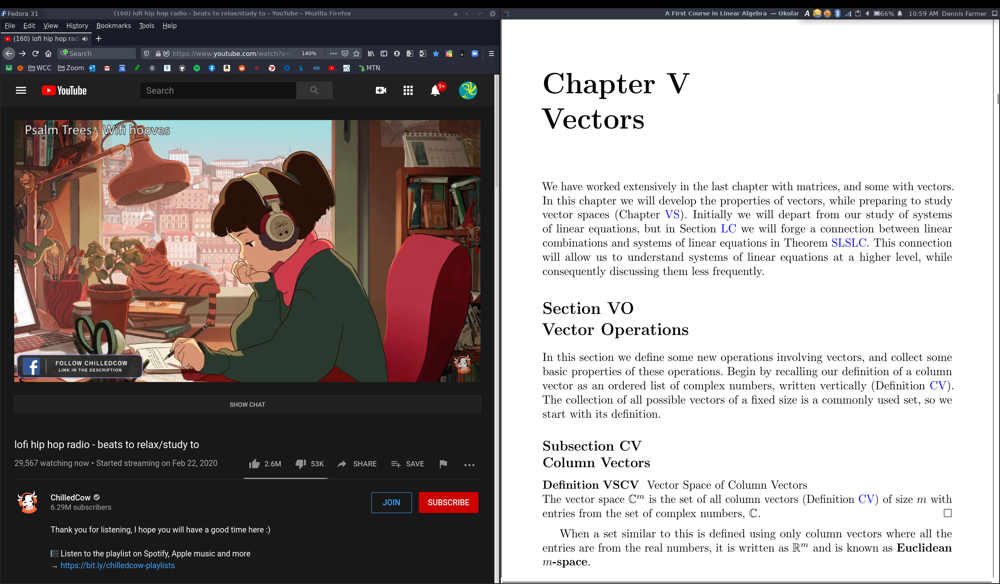

# My Dotfiles (System Configuration)

### X1 Carbon 3rd Gen (1440p):

 

# Screensaver:

- (xscreensaver) XMatrix

# Programs:
|                 |                      |
|:----------------|---------------------:|
|IDE:             | Jupiter Lab          |
|Text Editors:    | Kate, Spyder, VS Code|
|PDF Viewer:      | Okular               |
|Terminal:        | Konsole              |
|File Explorer:   | Thunar               |
|Image Program:   | GIMP                 |
|Media Player:    | VLC                  |
|Web Browser:     | Firefox              |

# Terminal Programs:

|                 |         |
|:----------------|--------:|
|Bluelight Filter:| Redshift|
|Cloud Storage:   | Onedrive|
|Text Editor:     | Vim     |

 

